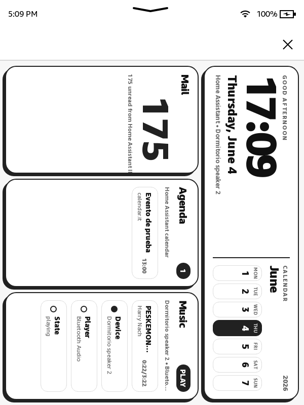

# Kindle Dashboard

A fast, simple, and clean HTML/JS dashboard specifically designed for jailbroken e-ink Kindles. Features integration with Home Assistant via Long-Lived Access Tokens and WebSockets.

## Features
- E-ink optimized UI (high contrast, no animations)
- Displays Mail count
- Music currently playing
- Calendar/Agenda
- Can run natively via KUAL

## Setup
1. Copy `hass-config.example.js` to `hass-config.js` and fill in your Home Assistant URL and token.
2. Deploy the files to `/mnt/us/documents/kindle-dashboard/` on your Kindle.
3. Launch using `launch.sh` (or via KUAL).

## Files
- `index.html`: The main dashboard UI.
- `launch.sh`: Script to launch the browser in true fullscreen mode.
- `stop.sh`: Script to cleanly kill the dashboard and restore the Kindle GUI.
- `menu.json`: KUAL menu configuration.
